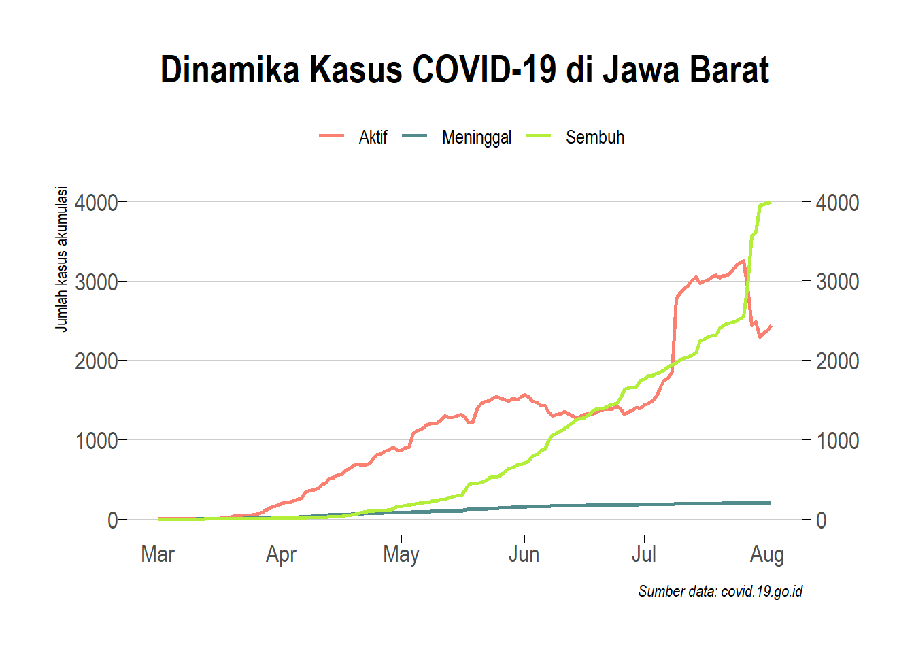

# Data visualization of COVID-19 data in West Java, Indonesia

Utilization of public data disclosure and data analysis techniques to understand the dynamics of the COVID-19 pandemic.

## Source

[Indonesia Goverment](https://https://covid19.go.id/)

